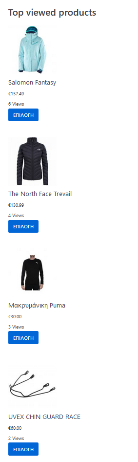
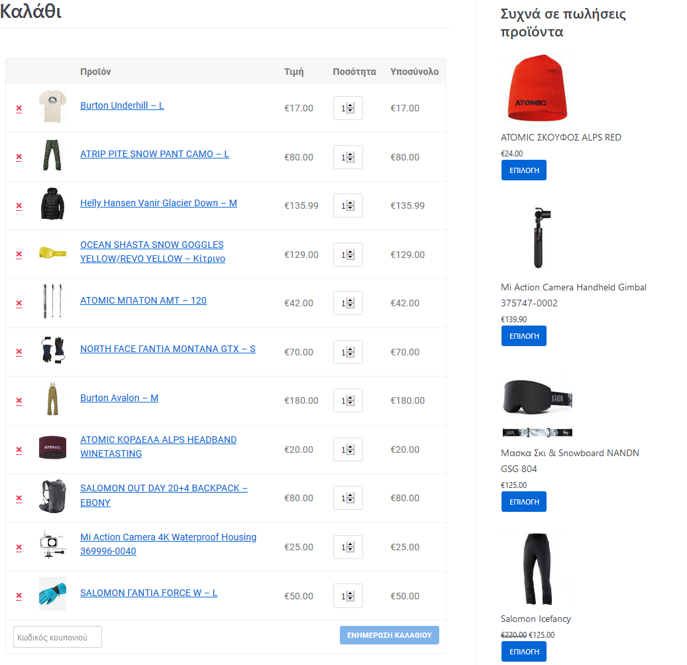

# E-commerce
Undergraduate project for the elective course [e-business](https://www.ceid.upatras.gr/en/undergraduate/courses/e-business).

## Authors
[Anna Mayaki](https://github.com/annamayaki) (4th year student)

[Romanos Kapsalis](https://github.com/rkapsalis) (4th year student)
## Description
In this project, we developed a ski clothing e-shop based on WooCommerce, called "Mountain Slope". In the database, 
you can easily see all the products and their variations in our shop. Additionally, we have 
created a plugin called ar_plugin. The plugin contains two shortcodes. With the first one [ar_shortcode1], you can display, in any page, the shop's top 
viewed items from a customer and with the second one [ar_shortcode2] the similar frequently bought products. Extensively, the customer can view products 
that are in the same category as those in his cart, but not those he has already bought 
before or are currently in his cart. 
## Mountain Slop (our eshop)

## Ar Plugin
### Top viewed products

### Similar frequently bought products

